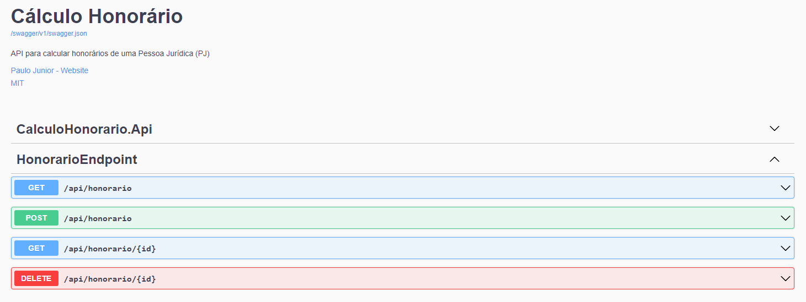

# Cálculo Honorário



## Sobre o Projeto

A api é para calcular o honorário de uma pessoa que desaja trabalhar como PJ (Pessoa Jurídica) e gostaria de ter ganhos semelhantes ao do CLT. A ideia para desenvolver essa api veio depois de ler essa matéria (https://tinyurl.com/bdek5umr).

## Tecnologias

- .NET 8

  - ASP.NET Minimal API
  - EF Core 8

- Banco de Dados

  - Postgres

- Componentes

  - FluentValidation
  - Swagger UI with JWT support

- Hosting

  - Docker (com compose)

- Teste
  - XUnit

## Arquitetura

Por ser uma Minimal API, tentei manter o projeto mais simples e sem muita complexidade. Porém acabei utilizando o conceito de três camadas, nesse caso, divisão em camadas lógicas.

A arquitetura foi implementada utilizando:

- DDD
- Repository Pattern
- Unit of Work

## Como Executar o Projeto

Você pode executar o Cálculo Honorário em qualquer sistema operacional. Certifique-se que tenha o docker instalado.

Clone o repositório do Cálculo Honorário e navague até a pasta **/Docker** e execute o seguinte comando:

```
docker-compose -p calculo-honorario-app up -d
```

No seu navegador digite _http://localhost:8080_. Dessa forma você utilizará o _Swagger_ para testar.

No VS, tem um arquivo chamado **CalculoHonorario.Api.http**. As duas primeiras linhas são variáveis com as URL's que pode utilizar. Caso esteja utilizando o docker, use a segunda linha com a porta 8080.

> **IMPORTANTE**: Não esqueça de trocar o **ID** no enpoint de _obter por id_ e _remover_.

NO VS Code, você pode executar com o [Thunder Cliente](https://marketplace.visualstudio.com/items?itemName=rangav.vscode-thunder-client) ou [Postman](https://marketplace.visualstudio.com/items?itemName=Postman.postman-for-vscode).

### Caso queira rodar no VS/VS Code

Você precisará ter:

- Dokcer
- Postgres instalado (ou container)

> **IMPORTANTE**: Não esqueça de executar a migrations para criar o banco de dados antes de executar o projeto

> **IMPORTANTE**: Não esqueça de executar alterar a _ConnectionString_ no arquivo **appsettings.Development.json**

## Disclaimer

Apesar de ter inspiração em um artigo de um site de economia. Esse projeto é puramente didático. Desenvolvi ele para colocar em prática alguns conhecimentos adquiridos nos cursos que realizei.

This project is licensed under the terms of the MIT license.
